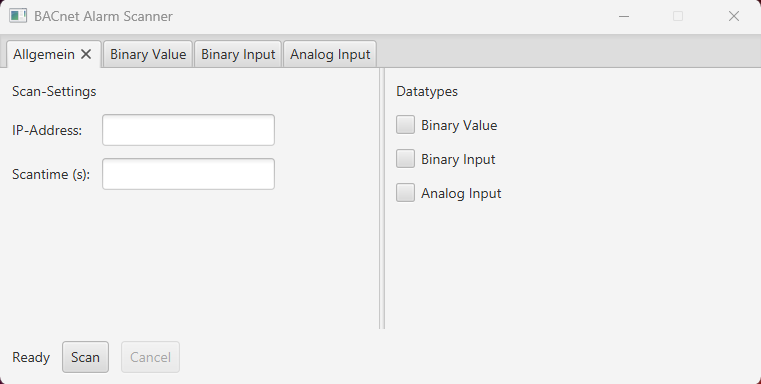
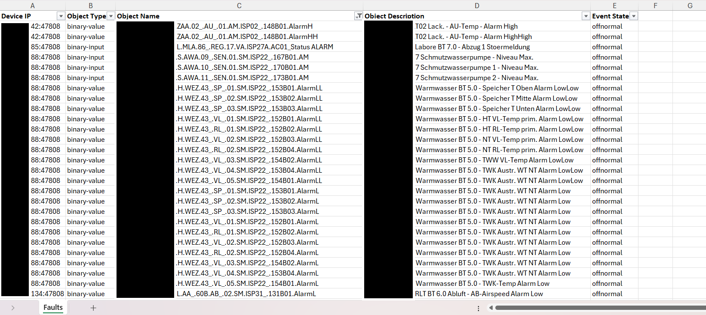

# BACnet Alarm Scanner – Engineering Tool for System Analysis

## Overview

In modern building automation systems, alarms and system states are typically managed and visualized within a BMS/GLT system.
However, during commissioning, troubleshooting or system validation, engineers often need direct access to BACnet-level data to verify system behavior and diagnose issues.

This project provides a Java-based diagnostic tool that scans BACnet devices and objects, extracts relevant properties and enables structured analysis of system states.

---

## Problem

While BMS/GLT systems provide a high-level overview, they do not always expose the full technical detail required for in-depth analysis.

In real-world scenarios, engineers and technicians often face challenges such as:

- verifying whether BACnet objects expose expected alarm or status properties
- checking object states directly on protocol level
- comparing GLT behavior with underlying BACnet data
- identifying missing, inconsistent or unexpected object information
- navigating large systems with many devices and data points

This process is often manual, time-consuming and requires deep system knowledge.

---

## Solution

The BACnet Alarm Scanner is designed as a lightweight engineering tool to support technical workflows in building automation.

It enables:

- automated scanning of BACnet devices
- extraction of relevant object properties
- structured representation of system data
- faster identification of inconsistencies or faults

The tool is not intended to replace a BMS/GLT system.
Instead, it complements existing systems by providing direct insight into BACnet-level data for engineering and troubleshooting purposes.

---

## Features

- Scan BACnet devices and objects
- Read and process relevant properties, such as status and alarm-related fields
- Structured output for technical analysis
- Support for troubleshooting and commissioning workflows
- Designed for real-world automation environments

---

## Example Use Case

During commissioning or troubleshooting, an engineer needs to verify whether specific BACnet objects expose correct status or alarm properties.

Instead of manually navigating through multiple devices:

1. The tool scans all relevant objects automatically.
2. It extracts the required data.
3. It provides a structured overview for technical analysis.

**Result:** faster diagnostics, reduced manual effort and improved system transparency.

---

## Tech Stack

- Java
- JavaFX (UI)
- BACnet protocol via bacnet4j
- Apache POI (Excel generation)
- Logging and data processing

---

## Example Output

- Structured alarm/status data
- Easy filtering and post-processing

---

## Current Status

This project is currently under active development.
Core functionality has been implemented and successfully tested in initial scenarios.

Planned improvements include:

- Support for BBMD (BACnet Broadcast Management Device) to enable scanning across multiple subnets
- Improved Excel report generation with structured multi-sheet output for better data organization
- extended support for additional object types
- additional validation in larger BACnet environments

---

## Motivation

This tool was developed based on practical experience in building automation and system engineering.

The goal is to simplify repetitive technical tasks, reduce manual analysis effort and provide better visibility into complex BACnet-based systems.

---

## Author

Maximilian Vosswinkel
